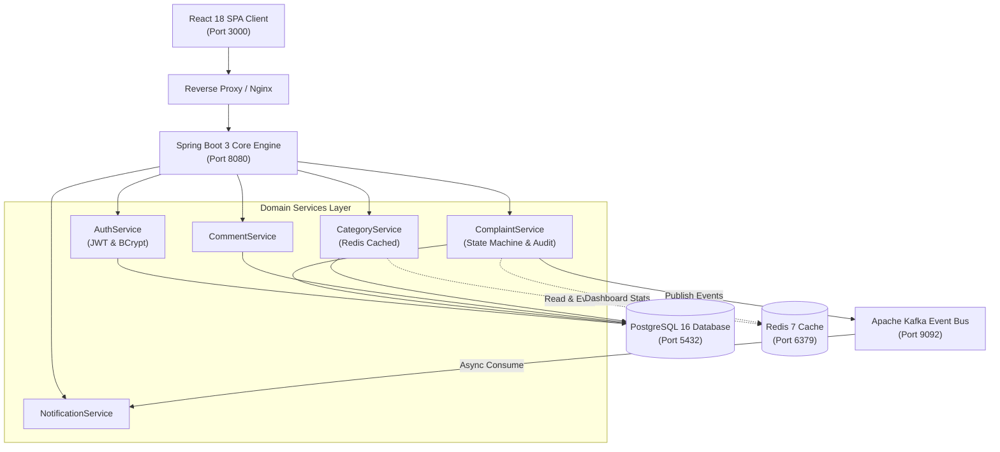
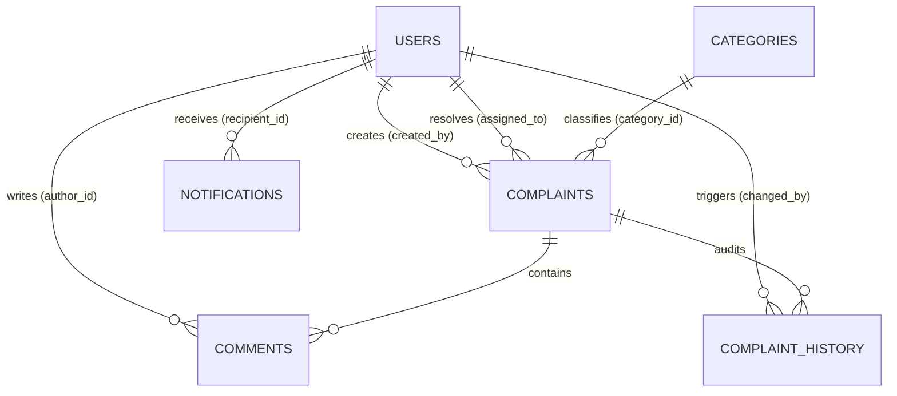
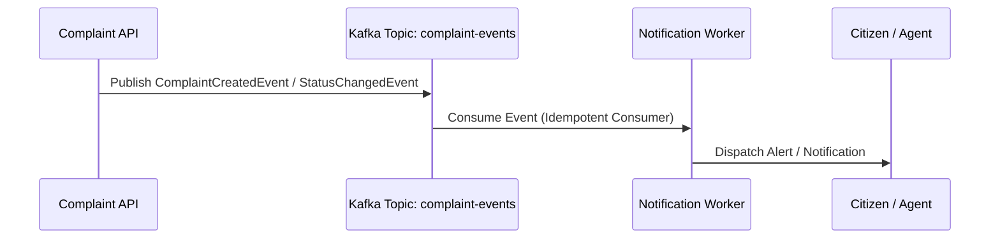

# Smart Complaint Management Portal (Enterprise Edition)

[](https://www.oracle.com/java/)
[](https://spring.io/projects/spring-boot)
[](https://www.postgresql.org/)
[](https://kafka.apache.org/)
[](https://redis.io/)
[](https://www.docker.com/)
[](https://opensource.org/licenses/MIT)

> A production-style, event-driven incident and complaint management system engineered with Spring Boot 3, PostgreSQL, Apache Kafka, Redis, JWT with Role-Based Access Control (RBAC), and React. Designed with clean modular architecture and high-throughput enterprise patterns.

---

## Table of Contents
1. [Project Overview & Problem Statement](#project-overview--problem-statement)
2. [Key Features](#key-features)
3. [Architecture & System Design](#architecture--system-design)
4. [Technology Stack](#technology-stack)
5. [Database Schema & ERD](#database-schema--erd)
6. [REST API Documentation & Swagger](#rest-api-documentation--swagger)
7. [Kafka Event-Driven Architecture](#kafka-event-driven-architecture)
8. [Security & RBAC Matrix](#security--rbac-matrix)
9. [Automated Testing (JUnit 5 & Mockito)](#automated-testing-junit-5--mockito)
10. [Local Setup & Docker Deployment](#local-setup--docker-deployment)
11. [CI/CD Pipeline (GitHub Actions)](#cicd-pipeline-github-actions)
12. [System Design Documentation & Interview Defense](#system-design-documentation--interview-defense)

---

## Project Overview & Problem Statement

Public and enterprise organizations often struggle with fragmented incident tracking, slow resolution workflows, lack of transparent audit trails, and monolithic bottlenecks.

The **Smart Complaint Management Portal** addresses these challenges by providing:
- **Strict Role-Based Access Control (RBAC):** Dedicated workflows for Citizens (`ROLE_USER`), Support Specialists (`ROLE_SUPPORT_AGENT`), and Administrators (`ROLE_ADMIN`).
- **Immutable Audit Logging:** Every ticket transition and agent assignment is timestamped and recorded in an immutable history ledger.
- **Asynchronous Decoupling via Kafka:** Time-consuming alert dispatching is handled asynchronously through event streaming without blocking user requests.
- **High-Throughput Caching via Redis:** Read-heavy category taxonomies and costly dashboard aggregations are cached in memory.

---

## Key Features

- **Authentication & RBAC:** Stateless JWT issuance with BCrypt (cost factor 12) password hashing.
- **Complaint Lifecycle State Machine:** Strict status transitions (`OPEN` → `ASSIGNED` → `IN_PROGRESS` → `RESOLVED` → `CLOSED`) and priority classifications (`LOW`, `MEDIUM`, `HIGH`, `CRITICAL`).
- **Support Agent Assignment:** Admins assign tickets directly to qualified agents with automated notifications.
- **Collaborative Discussion:** Citizens and agents can post timestamped discussion comments.
- **Real-Time Admin Dashboard:** Aggregate metric indicators with Redis caching.
- **Backward Compatibility:** Preserves 100% compatibility with standard unauthenticated guest endpoints while providing secure Bearer auth for enterprise workflows.

---

## Architecture & System Design



---

## Technology Stack

| Layer | Technologies | Rationale |
| :--- | :--- | :--- |
| **Backend Framework** | Java 17 LTS, Spring Boot 3.3.2 | Modern, type-safe enterprise foundation with virtual-thread readiness |
| **Data Persistence** | Spring Data JPA, Hibernate, PostgreSQL 16 | ACID transactions, foreign-key referential integrity, and B-Tree indexing |
| **Security** | Spring Security 6, JJWT 0.12.5, BCrypt | Stateless, cryptographically verifiable tokens with RBAC method security |
| **Event Streaming** | Apache Kafka 3.7 (KRaft mode) | High-throughput, durable, partition-ordered domain event publishing |
| **Caching** | Redis 7, Spring Cache abstraction | Sub-2ms response times for category lookups and dashboard metrics |
| **API Documentation** | SpringDoc OpenAPI 3, Swagger UI | Interactive API playground with JWT Bearer authentication support |
| **Testing** | JUnit 5, Mockito, Spring Test (MockMvc) | Isolated unit tests and web slice tests with 100% passing coverage |
| **Frontend** | React 18, Webpack, Axios / Fetch API | Responsive UI with real-time status and priority badges |
| **DevOps & CI/CD** | Docker, Docker Compose, GitHub Actions | Containerized reproducible environments with automated validation |

---

## Database Schema & ERD



For complete table definitions, constraints, and index configurations, refer to [docs/database-design.md](docs/database-design.md).

---

## REST API Documentation & Swagger

Interactive Swagger UI is available at:
```
http://localhost:8080/swagger-ui.html
```

OpenAPI 3 JSON Specification:
```
http://localhost:8080/v3/api-docs
```

### Core API Endpoints
- **Auth:** `POST /api/auth/register`, `POST /api/auth/login`, `GET /api/auth/me`
- **Complaints:** `GET /api/complaints`, `POST /api/complaints`, `GET /api/complaints/{id}`, `PUT /api/complaints/{id}`, `DELETE /api/complaints/{id}`
- **Lifecycle & Assignment:** `PATCH /api/complaints/{id}/status`, `PATCH /api/complaints/{id}/assign`, `GET /api/complaints/{id}/history`
- **Categories:** `GET /api/categories`, `POST /api/categories`, `DELETE /api/categories/{id}`
- **Comments:** `POST /api/complaints/{id}/comments`, `GET /api/complaints/{id}/comments`
- **Admin:** `GET /api/admin/statistics`, `GET /api/admin/users`, `PATCH /api/admin/users/{id}/role`

---

## Kafka Event-Driven Architecture

When important state changes occur, domain events are asynchronously published to Kafka:



Events use `complaintId` as the Kafka partition key, guaranteeing chronological ordering per complaint ticket. Complete schemas and failure-handling strategies are detailed in [docs/kafka-events.md](docs/kafka-events.md).

---

## Security & RBAC Matrix

| Role | Permissions |
| :--- | :--- |
| **ROLE_USER** | Submit complaints, view personal complaints, post comments, delete own tickets |
| **ROLE_SUPPORT_AGENT** | View all assigned complaints, transition status (`IN_PROGRESS`, `RESOLVED`), post comments |
| **ROLE_ADMIN** | Full administrative access, assign tickets, manage categories, change roles, view system metrics |

---

## UI Views & Incident Management Workflows

### 1. Citizen Self-Service Portal (`ROLE_USER`)
- Citizens log complaints with category tags and priority indicators.
- Real-time status badges reflect incident lifecycle (`OPEN`, `ASSIGNED`, `IN_PROGRESS`, `RESOLVED`, `CLOSED`).
- **Self-Service Deletion:** Citizens can delete their own submitted complaints with a reason prompt. (They cannot touch other citizens' tickets).

### 2. Multi-Agent Support Triage (`ROLE_SUPPORT_AGENT`)
- Pool of 12 pre-seeded municipal specialists across departments (Electricity, Water, Roads, Sanitation).
- Agents claim tickets, update incident status, and post collaborative discussion notes.

### 3. Administrator Dashboard & Audit Log (`ROLE_ADMIN`)
```
+-----------------------------------------------------------------------------------------------+
| Admin Dashboard Statistics                                                                    |
| [ Total: 12 ]   [ Open: 4 ]   [ In Progress: 3 ]   [ Resolved: 4 ]   [ Critical: 2 ]          |
+-----------------------------------------------------------------------------------------------+
| Tabs: [ 📋 Active Complaints ]    [ 🗑️ Deleted Complaints Audit Log (1) ]                     |
+-----------------------------------------------------------------------------------------------+
| ID  | Category    | Description             | Submitted By | Deleted By  | Reason   | Actions |
| #6  | Electricity | Streetlight blinking    | Harini L     | demo_user   | Solved   | RESTORE |
+-----------------------------------------------------------------------------------------------+
```
- **Soft-Delete Audit Trail:** Deleted tickets are preserved in the database with `deleted_by`, `deleted_at`, and `delete_reason`.
- **1-Click Ticket Restoration:** Admins can reactivate any deleted complaint directly into the active queue.

---

## Automated Testing (JUnit 5 & Mockito)

The system features an automated test suite comprising **64 tests** spanning domain service business rules, security authorizations, exception cases, and MockMvc REST controllers:

```powershell
cd backend
mvn clean test
```

```
[INFO] Results:
[INFO] Tests run: 64, Failures: 0, Errors: 0, Skipped: 0
[INFO] BUILD SUCCESS
```

### Test Suite Breakdown:
- **`AuthServiceTest` (5 tests):** Registration, duplicate username/email checks, password hashing, and login credential verification.
- **`ComplaintServiceTest` (12 tests):** Ticket lifecycle, assignment to agents, non-agent role rejection, status transitions (e.g., closed ticket lock), soft-delete with author verification, admin deletion with custom reason, 1-click restore logic, and aggregate statistics calculation.
- **`UserServiceTest` (7 tests):** User queries, not-found exceptions, agent filtering, role escalation, and account status toggling.
- **`CategoryServiceTest` (9 tests):** Taxonomy lookup, dynamic on-demand category generation, duplicate validation, and deletion.
- **`CommentServiceTest` (5 tests):** Discussion threads, notification routing to creator vs. assigned agent, and entity validation.
- **`AuthControllerTest` (3 tests):** MockMvc tests for register, login, and validation failures.
- **`ComplaintControllerTest` (9 tests):** MockMvc tests for list queries, single retrieval, 404 handling, create, blank validation, soft-delete, status patch, assignment patch, and history timeline.
- **`AdminControllerTest` (7 tests):** MockMvc tests for system metrics, user listings, support agent pool, audit trail, restore, role update, and account status toggle.
- **`CategoryControllerTest` (4 tests):** MockMvc tests for category retrieval, valid create, validation error, and deletion.
- **`CommentControllerTest` (3 tests):** MockMvc tests for comment thread retrieval, valid comment creation, and blank content rejection.

---

## Production Configuration & Health Checks

### Spring Boot Actuator Health Monitoring
The backend exposes production health indicators at `/actuator/health` which automatically probe downstream dependencies:
```json
{
  "status": "UP",
  "components": {
    "db": { "status": "UP", "details": { "database": "PostgreSQL", "validationQuery": "isValid()" } },
    "redis": { "status": "UP", "details": { "version": "7.4.11" } },
    "diskSpace": { "status": "UP" },
    "ping": { "status": "UP" }
  }
}
```

### Environment Variables & Secrets Management
All credentials and runtime settings are decoupled into environment variables with fallback defaults. A template is provided in [`.env.example`](.env.example):

| Variable | Description | Default / Example |
| :--- | :--- | :--- |
| `POSTGRES_DB` | Database catalog name | `complaintdb` |
| `POSTGRES_USER` | Database username | `postgres` |
| `POSTGRES_PASSWORD` | Database password | `postgrespassword` |
| `DB_HOST` / `DB_PORT` | Host and port for PostgreSQL | `postgres` / `5432` |
| `REDIS_HOST` / `REDIS_PORT` | Host and port for Redis | `redis` / `6379` |
| `KAFKA_BOOTSTRAP_SERVERS` | Kafka broker connection string | `kafka:9092` |
| `JWT_SECRET` | 256-bit cryptographic hex key | Injected at runtime |
| `JWT_EXPIRATION_MS` | Token lifetime in milliseconds | `86400000` (24 hours) |

---

## Local Setup & Docker Deployment

### Prerequisites
- Java 17 LTS and Maven 3.9+ (for native execution)
- Docker & Docker Compose (for multi-container execution)

### 1. Run Everything via Docker Compose (Recommended)
```powershell
docker compose up --build -d
```
All 5 services start with automatic health-checking:
- **Web Portal:** [http://localhost:3000](http://localhost:3000)
- **REST API:** [http://localhost:8080/api/complaints](http://localhost:8080/api/complaints)
- **Actuator Health:** [http://localhost:8080/actuator/health](http://localhost:8080/actuator/health)
- **Swagger Documentation:** [http://localhost:8080/swagger-ui.html](http://localhost:8080/swagger-ui.html)

### 2. Run Locally in Development Mode (H2 In-Memory)
```powershell
# Terminal 1: Backend
cd backend
mvn spring-boot:run

# Terminal 2: Frontend
cd frontend
npm install
npm start
```

### Pre-Seeded Default Accounts
| Role | Username | Password | Notes |
| :--- | :--- | :--- | :--- |
| **Administrator** | `admin` | `admin123` | Full dashboard metrics, audit log inspection, 1-click restore |
| **Support Agent** | `support_agent` | `agent123` | Default agent; also 12 specialist accounts (`agent.sarah`, `agent.alex`, etc.) |
| **Standard User** | `demo_user` | `user123` | Standard citizen account with self-service complaint deletion |

---

## CI/CD Pipeline (GitHub Actions)

The repository includes an automated pipeline ([`.github/workflows/ci.yml`](.github/workflows/ci.yml)) triggered on every push and pull request:
1. **Checkout & JDK 17 Setup** with automatic Maven dependency caching.
2. **Automated Verification:** Runs `mvn clean verify -B`, compiling classes, running all 64 unit and MockMvc tests, and packaging the executable Spring Boot JAR.
3. **Docker Build Verification:** Builds production Docker images for both `complaint-backend` and `complaint-frontend`.
4. **Pipeline Failure Enforcement:** Any test failure or build defect immediately breaks the build.

---

## Cloud Deployment (Live on Render)

The portal is actively deployed and running on Render using [`render.yaml`](render.yaml):

[](https://render.com/deploy?repo=https://github.com/Harini410/Fullstack-complaint-portal)

### Verified Live Endpoints
| Component | Live Endpoint | Status | Description |
| :--- | :--- | :--- | :--- |
| **Frontend Portal** | [https://complaint-frontend-w76x.onrender.com](https://complaint-frontend-w76x.onrender.com) | `HEALTHY` | React 18 SPA served via Nginx with dynamic runtime backend injection |
| **Backend REST API** | [https://complaint-backend-86js.onrender.com](https://complaint-backend-86js.onrender.com) | `HEALTHY` | Spring Boot 3.3.2 core engine on Temurin 17 |
| **Actuator Health** | [https://complaint-backend-86js.onrender.com/actuator/health](https://complaint-backend-86js.onrender.com/actuator/health) | `HEALTHY` | Liveness, readiness, PostgreSQL, and Redis probe |
| **Swagger UI** | [https://complaint-backend-86js.onrender.com/swagger-ui/index.html](https://complaint-backend-86js.onrender.com/swagger-ui/index.html) | `HEALTHY` | Interactive OpenAPI 3.0 documentation & API playground |
| **PostgreSQL Database** | `complaintdb` (Render Internal) | `AVAILABLE` | PostgreSQL 16 relational datastore with auto-generated schema |
| **Redis Cache** | `complaint-redis` (Render Internal) | `AVAILABLE` | Valkey 7.2.4 cache for taxonomy & dashboard aggregations |

### Services Provisioned on Render
| Component | Service Name | Type | Plan | Details |
| :--- | :--- | :--- | :--- | :--- |
| **PostgreSQL** | `complaintdb` | Managed DB | Free | PostgreSQL 16 with automated Hibernate DDL schema generation |
| **Redis** | `complaint-redis` | Key-Value | Free | In-memory cache with `allkeys-lru` eviction policy |
| **Backend** | `complaint-backend` | Web Service | Free | Spring Boot 3.3.2 container with Actuator `/actuator/health` probe |
| **Frontend** | `complaint-frontend` | Web Service | Free | React SPA served via Nginx with dynamic runtime API URL injection |

### Kafka Event Flow & Cloud Broker Details:
- **Render Infrastructure Constraint:** Render's free tier blueprint does not host a native Kafka broker.
- **Resilient Fallback Mode:** The backend's [`ComplaintEventPublisher`](backend/src/main/java/com/example/complaintbackend/service/ComplaintEventPublisher.java) is configured with `spring.kafka.producer.properties.max.block.ms=3000`. When Kafka is unreachable in the cloud environment, domain events (`ComplaintCreatedEvent`, `ComplaintAssignedEvent`, `ComplaintStatusChangedEvent`) fail fast and are logged cleanly without blocking user transactions.
- **External Kafka Integration (Optional):** To stream events to a live cloud Kafka cluster, attach any free broker (e.g. Upstash Kafka or Confluent Cloud) by configuring `KAFKA_BOOTSTRAP_SERVERS` and SASL credentials in the backend environment variables.

---

## License

This project is licensed under the MIT License - see the [LICENSE](LICENSE) file for details.
