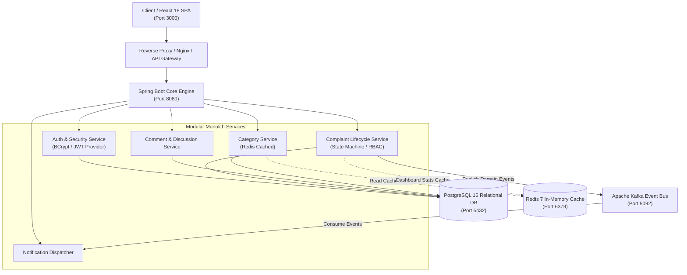
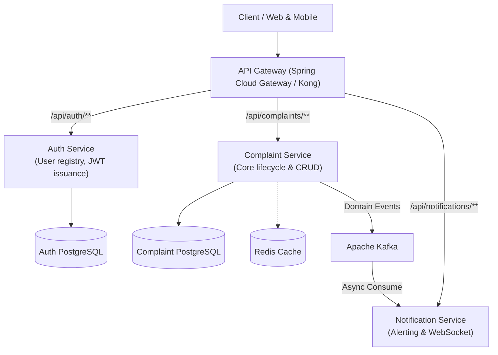

# System Architecture

## 1. High-Level Architectural Evolution

The Smart Complaint Management Portal is engineered using a **modular monolith** architectural pattern designed with clean domain boundaries that can be seamlessly extracted into independent microservices as operational load increases.



---

## 2. Layered Architecture (Separation of Concerns)

Every incoming HTTP request traverses distinct layers with strictly enforced boundaries adhering to the **Single Responsibility Principle (SRP)**:

```
HTTP Request
     │
     ▼
[ Controller Layer ]     ← Request validation (@Valid), HTTP status codes, Swagger metadata, DTO conversion
     │
     ▼
[ Service Layer ]        ← Transaction boundaries (@Transactional), business invariants, state machine, event dispatch
     │
     ▼
[ Repository Layer ]     ← Spring Data JPA, JPQL custom queries, pagination, database index utilization
     │
     ▼
[ Database Layer ]       ← PostgreSQL 16 (Foreign keys, uniqueness constraints, ACID transactions)
```

1. **REST Controller (`@RestController`):** Responsible solely for HTTP transport concerns, routing, request payload validation (`jakarta.validation`), and serializing responses into structured DTOs. Controllers **never** interact with JPA entities directly.
2. **Service Layer (`@Service`):** Contains all domain business logic, authorization rules (`@PreAuthorize`), status transition validations, domain event publishing, and cache eviction. Methods manage transactional boundaries with `@Transactional`.
3. **Repository Layer (`@Repository`):** Encapsulates data access mechanisms using Spring Data JPA with indexed JPQL filtering queries and `Pageable` parameters.
4. **DTO Layer:** Decouples external API representations from internal database schemas, shielding the system against mass-assignment vulnerabilities.

---

## 3. Microservices Transition Strategy

### Target Architecture (Phase 3 Evolution)



### Why Start with a Modular Monolith?
1. **Low Operational Overhead:** Eliminates network latency, distributed transaction complexities (Saga/2PC), and distributed tracing overhead during early-stage scaling.
2. **Clear Boundaries:** Modules communicate through well-defined service interfaces and asynchronous event publishers, allowing zero-friction separation into standalone microservices when team size or traffic demands it.
3. **Single Deployment Artifact:** Greatly simplifies CI/CD pipelines, container orchestration, and resource consumption.

---

## 4. Key Architectural Decisions (Interview Defense)

### Why PostgreSQL?
- **Relational Integrity:** Complaint workflows inherently require strong relational guarantees: complaints belong to categories and users, have multiple audit trail entries, and contain comments.
- **ACID Transactions:** Critical state transitions (e.g. assigning a support agent, changing status to RESOLVED) must be atomic and durable.
- **Indexing & JSON Support:** B-Tree indexes on `status`, `priority`, and foreign keys optimize multi-criteria filtering under heavy load.

### Why Kafka?
- **Decoupling Heavy Operations:** Sending email, SMS, or mobile push notifications upon complaint creation or resolution should never block the primary HTTP transaction.
- **Event Replayability:** Kafka's persistent log enables notifications or downstream audit consumers to replay events during service recovery or when onboarding new consumers.
- **Fault Tolerance:** If notification delivery services fail, domain events remain safe and ordered inside Kafka partitions.

### Why Redis?
- **Read-Heavy Invalidation:** Category taxonomies rarely change (99.9% read ratio). Caching categories eliminates redundant SQL lookups.
- **Expensive Aggregations:** Calculating dashboard statistics across millions of rows (`COUNT GROUP BY status`) degrades relational databases. Caching aggregated metrics with a 2-minute TTL provides high throughput with minimal stale-read impact.

### What Happens if Kafka is Down?
- The backend implements **resilient publishing** with graceful fallback. If the Kafka broker is unreachable, the event failure is logged in an error audit log without aborting the relational database transaction, ensuring continuous core business availability.
- In full enterprise mode, this is complemented by the **Transactional Outbox Pattern**: events are written to an `outbox` table within the same ACID transaction and polled by an asynchronous Debezium/Kafka Connect CDC worker.
