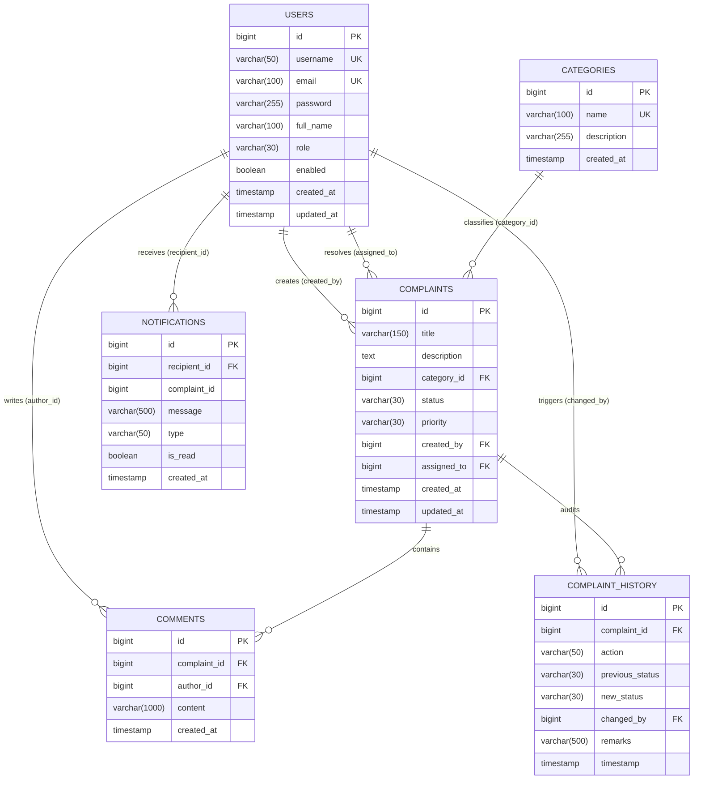

# Database Design & Relational Modeling

## 1. Entity-Relationship Diagram (ERD)



---

## 2. Table Specifications & Constraints

### `users` Table
Stores portal accounts, role allocations, and credentials.
| Column | Type | Constraints | Description |
| :--- | :--- | :--- | :--- |
| `id` | `BIGSERIAL` | `PRIMARY KEY` | Auto-incrementing identifier |
| `username` | `VARCHAR(50)` | `NOT NULL`, `UNIQUE` | Unique user login name |
| `email` | `VARCHAR(100)` | `NOT NULL`, `UNIQUE` | Contact & login email |
| `password` | `VARCHAR(255)` | `NOT NULL` | BCrypt-hashed password (cost factor 12) |
| `full_name` | `VARCHAR(100)` | `NULLABLE` | Display name of the user |
| `role` | `VARCHAR(30)` | `NOT NULL` | `ROLE_USER`, `ROLE_ADMIN`, `ROLE_SUPPORT_AGENT` |
| `enabled` | `BOOLEAN` | `DEFAULT TRUE` | Soft-disable user accounts |
| `created_at` | `TIMESTAMP` | `NOT NULL` | Audit timestamp |
| `updated_at` | `TIMESTAMP` | `NULLABLE` | Last modification timestamp |

### `categories` Table
Normalized complaint classification taxonomy.
| Column | Type | Constraints | Description |
| :--- | :--- | :--- | :--- |
| `id` | `BIGSERIAL` | `PRIMARY KEY` | Auto-incrementing identifier |
| `name` | `VARCHAR(100)` | `NOT NULL`, `UNIQUE` | E.g. "Electricity", "Water", "Sanitation" |
| `description` | `VARCHAR(255)` | `NULLABLE` | Category scope details |
| `created_at` | `TIMESTAMP` | `NOT NULL` | Creation timestamp |

### `complaints` Table
The central transactional entity.
| Column | Type | Constraints | Description |
| :--- | :--- | :--- | :--- |
| `id` | `BIGSERIAL` | `PRIMARY KEY` | Unique complaint ticket number |
| `title` | `VARCHAR(150)` | `NOT NULL` | Short summary of issue |
| `description` | `TEXT` | `NOT NULL` | Detailed incident description |
| `category_id` | `BIGINT` | `FOREIGN KEY (categories.id)` | Associated category |
| `status` | `VARCHAR(30)` | `NOT NULL` | `OPEN`, `ASSIGNED`, `IN_PROGRESS`, `RESOLVED`, `CLOSED` |
| `priority` | `VARCHAR(30)` | `NOT NULL` | `LOW`, `MEDIUM`, `HIGH`, `CRITICAL` |
| `created_by` | `BIGINT` | `FOREIGN KEY (users.id)` | Submitting citizen / user |
| `assigned_to` | `BIGINT` | `FOREIGN KEY (users.id)` | Support agent handling the ticket |
| `created_at` | `TIMESTAMP` | `NOT NULL` | Ticket submission timestamp |
| `updated_at` | `TIMESTAMP` | `NULLABLE` | Last update timestamp |

### `complaint_history` Table (Immutable Audit Log)
Records every status change and assignment event for compliance and SLA tracking.
| Column | Type | Constraints | Description |
| :--- | :--- | :--- | :--- |
| `id` | `BIGSERIAL` | `PRIMARY KEY` | Event ID |
| `complaint_id` | `BIGINT` | `FOREIGN KEY (complaints.id) ON DELETE CASCADE` | Complaint reference |
| `action` | `VARCHAR(50)` | `NOT NULL` | `CREATED`, `ASSIGNED`, `STATUS_UPDATED` |
| `previous_status`| `VARCHAR(30)` | `NULLABLE` | Status before transition |
| `new_status` | `VARCHAR(30)` | `NULLABLE` | Status after transition |
| `changed_by` | `BIGINT` | `FOREIGN KEY (users.id)` | Actor who initiated change |
| `remarks` | `VARCHAR(500)` | `NULLABLE` | Audit notes or reasons |
| `timestamp` | `TIMESTAMP` | `NOT NULL` | Immutable event timestamp |

---

## 3. Indexing Strategy

Targeted B-Tree indexes prevent full-table scans during heavy filter and dashboard aggregation queries:

```sql
-- User lookups for authentication (Login & JWT filter)
CREATE INDEX idx_users_username ON users (username);
CREATE INDEX idx_users_email ON users (email);

-- Complaint filtering and dashboard queries
CREATE INDEX idx_complaints_status ON complaints (status);
CREATE INDEX idx_complaints_priority ON complaints (priority);
CREATE INDEX idx_complaints_created_by ON complaints (created_by);
CREATE INDEX idx_complaints_assigned_to ON complaints (assigned_to);

-- Audit log and comment order lookups
CREATE INDEX idx_comments_complaint_id ON comments (complaint_id);
CREATE INDEX idx_history_complaint_id ON complaint_history (complaint_id);
CREATE INDEX idx_notifications_recipient ON notifications (recipient_id);
```

---

## 4. Normalization & Integrity Rationale

1. **Third Normal Form (3NF):** Non-key attributes depend solely on the primary key. Eliminating embedded strings for categories and users prevents update anomalies.
2. **Referential Integrity:** `FOREIGN KEY` constraints guarantee that complaints cannot reference nonexistent categories or users.
3. **Immutability of Audit History:** The `complaint_history` records are append-only. No `UPDATE` or `DELETE` operations are exposed on historical audit records.
