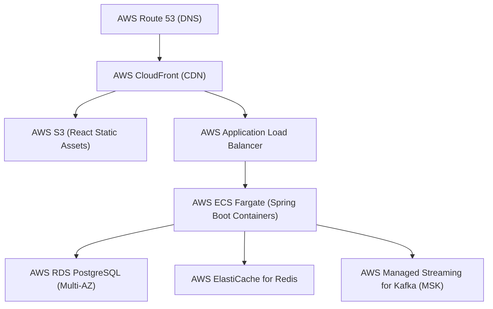

# Deployment Guide & Cloud Infrastructure Roadmap

## 1. Local Deployment (Docker Compose)

The entire portal stack can be spun up locally with a single command:

```powershell
docker compose up --build -d
```

### Services Provisioned
| Service | Image / Build | Port | Purpose |
| :--- | :--- | :--- | :--- |
| `postgres` | `postgres:16-alpine` | `5432` | Relational database storage |
| `redis` | `redis:7-alpine` | `6379` | In-memory cache for taxonomy & metrics |
| `kafka` | `apache/kafka:3.7.0` | `9092` | Event bus for asynchronous event processing |
| `backend` | Multi-stage Dockerfile | `8080` | Spring Boot REST Core API |
| `frontend` | Multi-stage Nginx | `3000` | React Single Page Application |

### Verification
- Frontend UI: `http://localhost:3000`
- Backend REST API: `http://localhost:8080/api/complaints`
- Swagger UI Documentation: `http://localhost:8080/swagger-ui.html`
- OpenAPI Specification: `http://localhost:8080/v3/api-docs`

---

## 2. Environment Variables Configuration

| Variable | Default Value | Description |
| :--- | :--- | :--- |
| `SPRING_PROFILES_ACTIVE` | `dev` | Active Spring profile (`dev` for H2, `prod` for PostgreSQL) |
| `DB_HOST` | `localhost` / `postgres` | Database hostname |
| `DB_PORT` | `5432` | PostgreSQL port |
| `DB_NAME` | `complaintdb` | Database schema name |
| `DB_USERNAME` | `postgres` | Database user credentials |
| `DB_PASSWORD` | `postgrespassword` | Database password |
| `REDIS_HOST` | `localhost` / `redis` | Redis server hostname |
| `REDIS_PORT` | `6379` | Redis server port |
| `KAFKA_BOOTSTRAP_SERVERS` | `localhost:9092` / `kafka:9092` | Kafka broker endpoints |
| `JWT_SECRET` | `404E635266556...` | HMAC-SHA256 256-bit signing key |
| `JWT_EXPIRATION_MS` | `86400000` | Token lifetime (24 hours) |

---

## 3. Production Cloud Deployment Blueprint (AWS Architecture)



1. **Frontend Hosting:** React build bundled to an AWS S3 bucket distributed globally via AWS CloudFront CDN with SSL termination.
2. **Backend Services:** Packaged into lightweight OCI container images hosted on AWS Elastic Container Service (ECS) Fargate or AWS Elastic Kubernetes Service (EKS) with Horizontal Pod Autoscaler (HPA).
3. **Database Tier:** AWS RDS PostgreSQL Multi-AZ deployment with automated daily snapshots, connection pooling, and read replicas.
4. **Managed Kafka & Redis:** AWS MSK (Managed Streaming for Kafka) and AWS ElastiCache for Redis.
