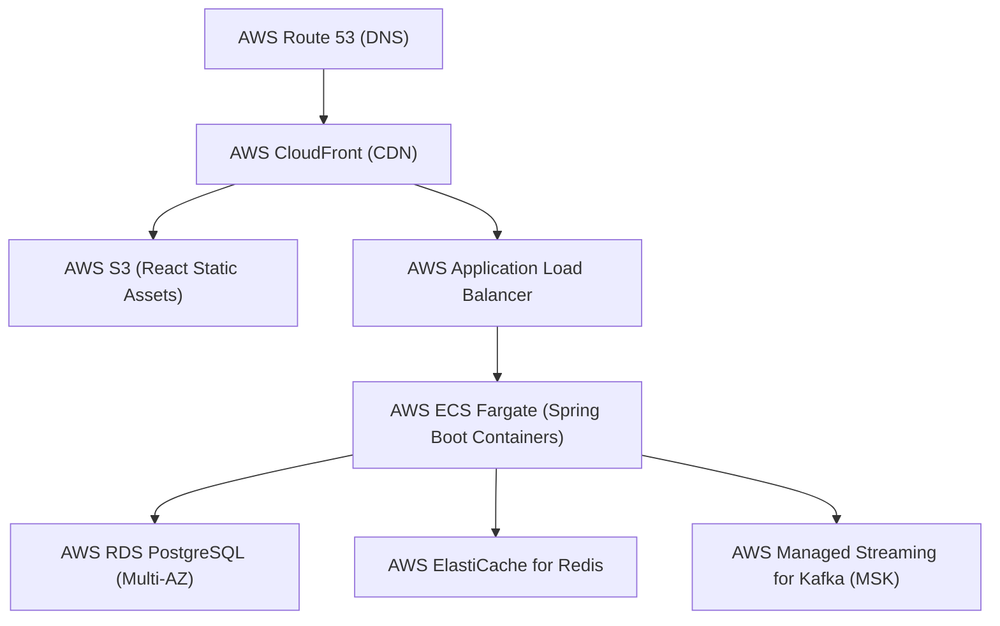

# Deployment Guide & Cloud Infrastructure Roadmap

## 1. Local Deployment (Docker Compose)

The entire portal stack can be spun up locally with a single command:

```powershell
docker compose up --build -d
```

### Services Provisioned
| Service | Image / Build | Port | Purpose |
| :--- | :--- | :--- | :--- |
| `postgres` | `postgres:16-alpine` | `5432` | Relational database storage |
| `redis` | `redis:7-alpine` | `6379` | In-memory cache for taxonomy & metrics |
| `kafka` | `apache/kafka:3.7.0` | `9092` | Event bus for asynchronous event processing |
| `backend` | Multi-stage Dockerfile | `8080` | Spring Boot REST Core API |
| `frontend` | Multi-stage Nginx | `3000` | React Single Page Application |

### Verification
- Frontend UI: `http://localhost:3000`
- Backend REST API: `http://localhost:8080/api/complaints`
- Swagger UI Documentation: `http://localhost:8080/swagger-ui.html`
- OpenAPI Specification: `http://localhost:8080/v3/api-docs`

---

## 2. Environment Variables Configuration

| Variable | Default Value | Description |
| :--- | :--- | :--- |
| `SPRING_PROFILES_ACTIVE` | `dev` | Active Spring profile (`dev` for H2, `prod` for PostgreSQL) |
| `DB_HOST` | `localhost` / `postgres` | Database hostname |
| `DB_PORT` | `5432` | PostgreSQL port |
| `DB_NAME` | `complaintdb` | Database schema name |
| `DB_USERNAME` | `postgres` | Database user credentials |
| `DB_PASSWORD` | `postgrespassword` | Database password |
| `REDIS_HOST` | `localhost` / `redis` | Redis server hostname |
| `REDIS_PORT` | `6379` | Redis server port |
| `KAFKA_BOOTSTRAP_SERVERS` | `localhost:9092` / `kafka:9092` | Kafka broker endpoints |
| `JWT_SECRET` | `404E635266556...` | HMAC-SHA256 256-bit signing key |
| `JWT_EXPIRATION_MS` | `86400000` | Token lifetime (24 hours) |

---

## 3. Cloud Deployment (Render Blueprint)

The repository provides a complete Infrastructure-as-Code Blueprint in [`render.yaml`](../render.yaml) for 1-click cloud provisioning.

### 1-Click Cloud Deployment
[](https://render.com/deploy?repo=https://github.com/Harini410/Fullstack-complaint-portal)

Clicking the button or importing `https://github.com/Harini410/Fullstack-complaint-portal` on [Render Blueprints](https://dashboard.render.com/blueprints) provisions:
1. **`complaintdb`**: Managed PostgreSQL 16 database (Free tier).
2. **`complaint-redis`**: Managed Key-Value store / Valkey-Redis cache with `allkeys-lru` eviction (Free tier, internal private network).
3. **`complaint-backend`**: Multi-stage Docker container running Spring Boot 3.3.2 with `/actuator/health` probe (Free tier).
4. **`complaint-frontend`**: Multi-stage Docker container running Nginx + React SPA with runtime environment injection (Free tier).

### Kafka Architecture & Event Flow on Render
- **Render Infrastructure Constraint:** Render does not provide a managed Kafka broker on its standard free tier.
- **Architectural Resilience:** The application is architected with resilient decoupling via [`ComplaintEventPublisher.java`](../backend/src/main/java/com/example/complaintbackend/service/ComplaintEventPublisher.java).
  - In local Docker Compose or environments with a running Kafka broker, domain events (`ComplaintCreatedEvent`, `ComplaintAssignedEvent`, `ComplaintStatusChangedEvent`) are published directly to the `complaint-events` topic.
  - If a Kafka broker is unreachable or unconfigured in the cloud environment, `sendEvent()` catches broker connection timeouts gracefully, logs the event locally, and ensures the core business operation (complaint creation, assignment, status update) succeeds without breaking the user transaction.
- **Connecting Cloud Kafka (Optional):** To stream events to a live cloud Kafka broker without running a dedicated cluster, attach a free serverless Kafka cluster (e.g., [Upstash Kafka](https://upstash.com/docs/kafka/overall/getstarted) or Confluent Cloud) by defining:
  - `KAFKA_BOOTSTRAP_SERVERS`: `<upstash-endpoint>:9092`
  - `spring.kafka.properties.security.protocol`: `SASL_SSL`
  - `spring.kafka.properties.sasl.mechanism`: `SCRAM-SHA-256`
  - `spring.kafka.properties.sasl.jaas.config`: `org.apache.kafka.common.security.scram.ScramLoginModule required username="..." password="...";`

---

## 4. Production Cloud Deployment Blueprint (Enterprise AWS Architecture)



1. **Frontend Hosting:** React build bundled to an AWS S3 bucket distributed globally via AWS CloudFront CDN with SSL termination.
2. **Backend Services:** Packaged into lightweight OCI container images hosted on AWS Elastic Container Service (ECS) Fargate or AWS Elastic Kubernetes Service (EKS) with Horizontal Pod Autoscaler (HPA).
3. **Database Tier:** AWS RDS PostgreSQL Multi-AZ deployment with automated daily snapshots, connection pooling, and read replicas.
4. **Managed Kafka & Redis:** AWS MSK (Managed Streaming for Kafka) and AWS ElastiCache for Redis.
