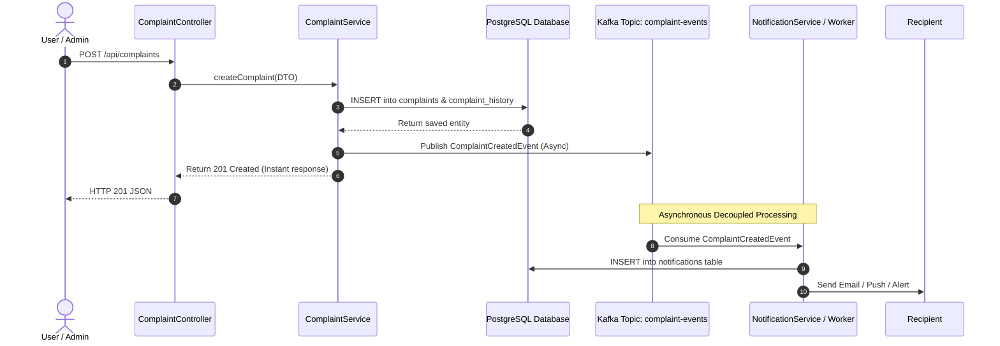

# Kafka Event-Driven Architecture & Message Flow

## 1. Event Flow Diagram



---

## 2. Domain Event Schemas

Events are serialized as JSON payloads with the complaint ID utilized as the **Kafka message key** to ensure partition-level ordering.

### 1. `ComplaintCreatedEvent`
Published immediately after a new complaint is persisted.
```json
{
  "complaintId": 105,
  "title": "Street light not working",
  "createdById": 10,
  "createdByName": "harini",
  "category": "Electricity",
  "priority": "HIGH",
  "timestamp": "2026-09-25T10:30:00"
}
```

### 2. `ComplaintAssignedEvent`
Published when an administrator assigns a ticket to a support agent.
```json
{
  "complaintId": 105,
  "title": "Street light not working",
  "assignedToId": 20,
  "assignedToName": "support_agent",
  "assignedById": 1,
  "assignedByName": "admin",
  "timestamp": "2026-09-25T10:35:00"
}
```

### 3. `ComplaintStatusChangedEvent`
Published upon valid status transition (`OPEN` → `ASSIGNED` → `IN_PROGRESS` → `RESOLVED` → `CLOSED`).
```json
{
  "complaintId": 105,
  "title": "Street light not working",
  "previousStatus": "IN_PROGRESS",
  "newStatus": "RESOLVED",
  "changedById": 20,
  "changedByName": "support_agent",
  "remarks": "Replaced fuse and fixture in pole #42",
  "timestamp": "2026-09-25T11:45:00"
}
```

---

## 3. Partitioning, Ordering & Idempotency

### Partition Key Strategy
- **Message Key:** `complaintId.toString()`
- **Rationale:** Kafka guarantees strict in-order message delivery within a single partition. By hashing the `complaintId` as the record key, all lifecycle events for a specific ticket (`CREATED` → `ASSIGNED` → `RESOLVED`) are guaranteed to land on the same partition and be consumed sequentially.

### Handling Duplicate Events (Idempotent Consumers)
In distributed message queues, network partitions or consumer rebalances can trigger **at-least-once delivery**, resulting in duplicate message reads.
1. **Deduplication ID:** Every event can carry an `eventId` (UUID) or use `complaintId + action + timestamp`.
2. **Database Level Idempotency:** The notification consumer performs an `INSERT ... ON CONFLICT DO NOTHING` or checks `processed_events` table before dispatching downstream notifications.

### Handling Broker Failures & Resilience
1. **Graceful Fallback:** If the Kafka cluster is temporarily unreachable, the `ComplaintEventPublisher` logs a warning and does not roll back the PostgreSQL database transaction. This protects the primary user-facing REST API against secondary infrastructure outages.
2. **Transactional Outbox Pattern (Enterprise Evolution):**
   - The complaint service writes both the complaint entity and an `OutboxEvent` record in a single database transaction.
   - An asynchronous Debezium CDC worker reads the Postgres Write-Ahead Log (WAL) and streams records to Kafka with zero data loss, guaranteeing **dual-write consistency**.
