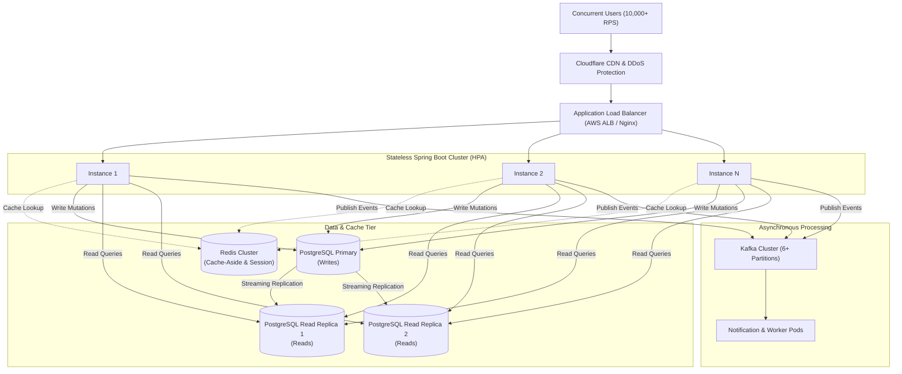

# Scalability & High-Throughput System Design

## 1. High-Concurrency Architecture Blueprint



---

## 2. Stateless Backend Scaling (Application Tier)

- **Statelessness:** The backend stores zero user session state in memory. All authentication relies on cryptographically verifiable JWTs.
- **Horizontal Scaling:** Spring Boot instances can scale from 2 to 50+ pods behind a Round-Robin / Least-Connections Load Balancer with zero session stickiness required.
- **Graceful Shutdown:** Configured with `server.shutdown=graceful` so that in-flight requests complete before pod termination during auto-scaling events.

---

## 3. Database Scaling & Optimization

### Connection Pooling (HikariCP)
- The application uses HikariCP with optimized pool limits:
  ```properties
  spring.datasource.hikari.maximum-pool-size=10
  spring.datasource.hikari.minimum-idle=5
  spring.datasource.hikari.connection-timeout=20000
  ```
- **Connection Calculation:** Following PostgreSQL guidelines:
  $$\text{Pool Size} = (\text{CPU Cores} \times 2) + \text{Disk Spindle Count}$$
  Preventing excessive thread context switching at the database engine.

### Read/Write Split (Replication)
- **Primary Node:** Handles all mutations (`INSERT`, `UPDATE`, `DELETE`) with full ACID isolation.
- **Read Replicas:** Read-heavy queries (listing complaints, filtering, search) are routed to asynchronous read replicas using a custom routing `AbstractRoutingDataSource`.

---

## 4. Caching Patterns with Redis

### Cache-Aside Pattern
1. Service checks Redis for requested key.
2. If **Cache Hit**: Returns data directly from memory (< 2ms latency).
3. If **Cache Miss**: Reads from PostgreSQL, saves to Redis with TTL, and returns to user.

```
Read Request ──> Redis Hit? ──Yes──> Return Data
                      │
                     No
                      ▼
               Read PostgreSQL ──> Write to Redis (TTL) ──> Return Data
```

### Cache Invalidation Strategy
- **Explicit Eviction (`@CacheEvict`):** When an admin creates or deletes a category, or when a complaint status changes, the corresponding cache entries are immediately invalidated.
- **Time-to-Live (TTL):** Categories TTL = 1 Hour; Dashboard statistics TTL = 2 Minutes, preventing stale data buildup without manual intervention.

---

## 5. Kafka Streaming Throughput

- **Partitioning:** High-volume topics (e.g. `complaint-events`) are divided across multiple partitions (e.g., 6 or 12 partitions).
- **Parallel Consumer Scaling:** Multiple notification service instances can join the same `consumer-group` (`complaint-notification-group`). Kafka automatically assigns partitions evenly across active consumer pods, achieving horizontal message processing parallelism.
