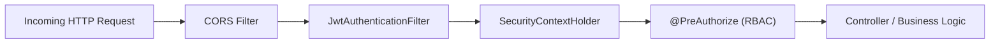

# Security, Authentication & Authorization Architecture

## 1. Security Architecture Overview

The system implements defense-in-depth security principles across transport, authentication, authorization, and data storage.

---

## 2. Password Security (BCrypt Hashing)

- **Algorithm:** BCrypt with a cost factor (log rounds) of `12`.
- **Salt Generation:** Each user password has an automatically generated cryptographic 128-bit salt embedded directly within the resulting modular crypt format string (`$2a$12$...`).
- **Resistance:** BCrypt is intentionally CPU- and memory-intensive, preventing rainbow table attacks and hardware-accelerated (GPU/ASIC) brute-force attempts.

---

## 3. JWT Stateless Authentication Lifecycle

1. **Token Generation:**
   - Generated upon successful login or registration in `JwtService`.
   - Algorithm: `HS256` (HMAC with SHA-256) signed using a 256-bit secret key.
   - Claims Payload:
     - `sub`: Username / Subject identifier
     - `userId`: Numeric user ID
     - `roles`: Assigned user role (e.g. `ROLE_ADMIN`)
     - `iat`: Timestamp issued
     - `exp`: Expiration timestamp (default: 24 hours)
2. **Filter Interception:**
   - Every request is intercepted by `JwtAuthenticationFilter` (extending `OncePerRequestFilter`).
   - Parses `Authorization: Bearer <token>`.
   - Validates cryptographic signature and expiration.
   - Populates Spring's `SecurityContextHolder` with authenticated `CustomUserDetails`.

---

## 4. Role-Based Access Control (RBAC) Matrix

| Operation | Endpoint | ROLE_USER | ROLE_SUPPORT_AGENT | ROLE_ADMIN | Guest |
| :--- | :--- | :---: | :---: | :---: | :---: |
| Register / Login | `/api/auth/**` | Yes | Yes | Yes | Yes |
| View Complaints | `/api/complaints` | Own / All | All | All | Read-only |
| Create Complaint | `/api/complaints` | Yes | Yes | Yes | Yes (demo) |
| Update Complaint Details | `/api/complaints/{id}` | Owner | Yes | Yes | No |
| Change Status | `/api/complaints/{id}/status` | No | Yes | Yes | No |
| Assign Agent | `/api/complaints/{id}/assign` | No | No | Yes | No |
| Delete Complaint | `/api/complaints/{id}` | Owner | No | Yes | No |
| Manage Categories | `/api/categories` (POST/DELETE) | No | No | Yes | No |
| Admin Dashboard Metrics | `/api/admin/**` | No | No | Yes | No |

---

## 5. Vulnerability Defense (OWASP Top 10)

1. **Mass Assignment Prevention:**
   - JPA entities are never exposed in `@RequestBody`. Strict DTOs (`ComplaintCreateRequest`, `ComplaintUpdateRequest`) control precisely which fields can be updated by external callers.
2. **SQL Injection Defense:**
   - All database queries utilize Spring Data JPA method queries or parameterized JPQL queries with `:param` syntax. Raw string concatenation in SQL is completely forbidden.
3. **Cross-Origin Resource Sharing (CORS):**
   - Configured via `CorsConfigurationSource` restricting allowed origins (`http://localhost:3000`, `http://localhost:5173`) and allowed HTTP methods.
4. **Stateless CSRF Rationale:**
   - CSRF tokens are disabled because authentication tokens are passed explicitly via the `Authorization: Bearer` header rather than ambient browser session cookies. Browsers do not automatically attach Bearer headers during cross-site requests, mitigating CSRF by design.
5. **Zero Secrets in Code:**
   - Database credentials and JWT signing keys are injected via environment variables (`${JWT_SECRET}`, `${DB_PASSWORD}`) with fallback defaults only enabled in development.
